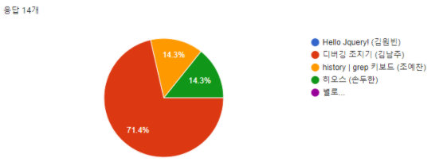
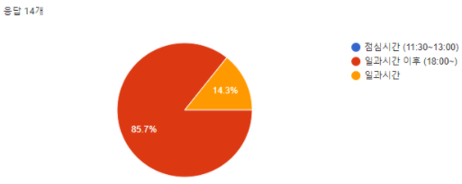
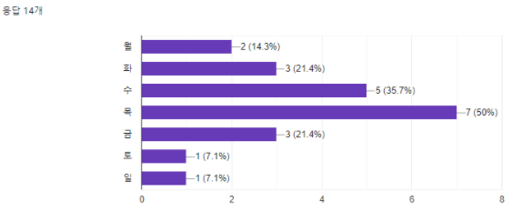
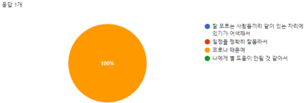

# 첫번째 모임

## 목차

[1. 개요](#1-개요)

[2. 일정](#2-일정)

[3. 내용](#3-내용)

---

## 1. 개요

- 의도
  - 사내 개발자들과의 커뮤니케이션 활성화 및 지식 나눔을 위해 모임 기획
- 준비 
  - 발표자 및 주제를 미리 선정하고, 발표자료를 준비하여 발표 진행
- 진행방식
  - 발표는 최대한 10분 내외로 하며, 발표주제는 중복되지 않도록 사전에 조치
  - 발표 후에는 간단한 Q&A 진행

## 2. 일정 

- 기간 : 2021.07.13 (화요일) 18:00 ~ 17:20
- 대상 : 사내 개발자 및 누구나
- 장소 : 사내 회의실

## 3. 내용 

- 기획 의도 설명

- 발표
  1. Hello Jquery! (jQuery) - [발표 슬라이드](./slides/01_Hello_jquery.pptx) / [발표자료](./slides/data/01_Hello_jquery.html)
  2. 디버깅 조지기 (디버깅) - [발표 슬라이드](./slides/02_디버깅조지기.pptx)
  3. history | grep 키보드 (키보드) - [발표 슬라이드](./slides/03_history_grep_키보드.pptx)
  4. 히오스 (오라클 함수) - [발표 슬라이드](./slides/04_히오스.pptx)

- 마침

- 저녁식사 

## 4. 설문조사

1. 21.07.13 18시에 진행된 개발 모임에 참여하였습니까?


2. 관심 있는 개발 분야?


3. 인상 깊었던 발표 주제는?



4. 굳이 필요 없었던 발표 주제를 고른다면?


5. 다음 모임에도 참관할 의사가 있는지?


6. 다음 모임에서 발표를 맡을 의향이 있는지?


7. 모임 시간은 언제가 적당하다고 생각하는가?



8. 모임 요일은 언제가 적당하다고 생각하는가?



9. 모임에 대한 의견을 남겨주세요 (욕 써도 됨)


```
어디선가 출처를 알 수 없는 예찬과장님이 리액트를 알려준다는 얘기를 듣고 참관하였으나 기대와는 다른 주제였지만 햇갈렸던 제이쿼리 문법, 스크립트 디버깅, 오라클 유사도 함수를 알 수 있어 뜻깊은 자리였다고 생각하며, 예찬과장님의 아이스브레이킹용 키보드 관련 주제로 냉냉한 분위기를 조금이나마 따뜻하게 만들었다고 생각합니다.
```
```
이번 발표를 준비하신 과장님들의 노력에 진심으로 박수를 보내드립니다만 본인이 발표하는 일은 없었으면 좋겠습니다. 이상입니다.
```
```
굳이 필요없던 발표주제는 없었으나 필수값에 의해 별로를 선택한 점 이해부탁드립니다.
```
```
수고했어요
```
```
키보드에 관심을 가지게 되었습니다
```
```
정성스럽게 준비해주셔서 감사합니다. 유익한 시간이었습니다!
```
```
유익했어욥
```
```
1. 발표 전에 주제 투표&의견 내기 -> 주제 관련 공부 및 지식, 서치내용 정리 -> 발표&토론 하는 방식으로 하면 참여율이 더 높아지지 않을가 싶어요.
2. 그날 모임 주제 관심있는 사람은 당일 개발 발표 주제를 알면 의견을 내지 않았어도 참여도 가능할 듯 싶고.
3. 모임을 블로그나, 어디 기록할곳에 쌓아두는건 어떠신지^.^?
```
```
소소하게 계속 이런 모임??발표?? 그런 자리가 많아서 분위기 가 좋아졌으면
```
```
발표 뿐만 아니라 후에 자기가 관심있는 분야라던가 최근 이슈되는 개발관련 얘기도 많이 나눌 수 있는 시간이 됐으면 좋겠습니다
```
```
주제를 정해서 진행하는 토론 형식이어도 괜찮을 것 같습니다.
```
```
우선 진행이 미흡 했던거 같고, Q&A 에 대한 대응이 아쉬웠습니다.
너무 경직된 발표 분위기도 아쉬웠습니다.
```
```
팁 공유 좋았고 친목을 다질수 있어서 좋았습니다. 담부터는 저녁 필참이라고 하면 참석률이 낮아 질까요? 유익한 자리였습니다.
```
```
사내모임이 많아졌으면 좋겠습니다
```
```
Q&A는 빼는 것이 낫지 않을까라는 느낌적인 느낌..
```

10. 모임에 참여하지 않은 이유는 무엇인가요?


